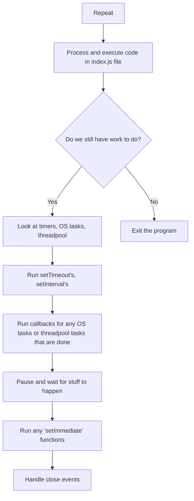

# Chapter 1
## Inside Node.js
Its main purpose obviously is to let you run javascript outside the browser using the *V8 engine* developped by Google, and also uses the *libuv* project that is made using C++, it gives node access to the file system, networking and some concurrency…

Node is an interface to all the C++ that is making the JS run using a serie of **wrappers**.

> JS is made like 50% with C++, and its goal is to give a nice consistent API to work with 

In the node project, in the *lib* directory, there is the JavaScript functions we call in our node code, and the lib directory contains the C++ libraries and functions (`libuv`)

if we take the `‌pbkdf2` function in the `‌node/lib/internal/crypto/pbkdf2.js`, we would find this in the function…
At the start there is a little bit of ‌**air checking**. then calls `_pbkdf2` which also calls `PBKDF2` which is the C++ implementation, after that we are going to find a very weird `require` statement, which is the code that calls the C++

So the V8 engine converts the between C++ and JS, it all depends, some use the `process.binding()`, or maybe other methods.

## The Event Loop
The event loop in node.js is what keeps the program running, it’s like a single thread with 5 tasks that keeps running under some condition, here is a pseudo code that makes things clearer:

```js
const pendingTimers = []
const pendingOSTasks = []
const pendingOperations = []

function shouldContinue () {
	// check one: Any pending setTimeout, setInterval, setImmediate
	// check two: Any pending OS tasks (such as listening to ports)
	// check three: Any pending long running operations (like using the fs module)
	
	return pendingTimers.length || pendingOSTasks.length || pendingOperations.length
}

// the main event loop
while (shouldContinue) {
	// 1) look at pendingTimers, then check to see if there are any pending timers ready to be called (only setTimeout and setInterval)
	
	// 2) look at pendingTasks and pendingOperations and call relevant callbacks
	
	// 3) pause execution, continue when
	// - a new pendingOSTask is done
	// - a new pendingOperation is done
	// - a timer is about to complete
	
	// 4) look at pendingTimers and call any setImmediate
	
	// 5) handle any `close` events
}
```

```js
// close event example

readStream.on('close', () => {
	console.log('cleanup code')
})
```

Node is not single threaded, things that run outside of the even loop are multithreaded…

[here](./chapter-1/threads.js) is a concrete example on it, what’s happening is that the `libuv` is creating multiple threads. in this case, the C++ does the hashing outside of the event loop.

The threads execute in a thread pool, and that thread pool contains four threads by default, and you can change that, either increasing the number of threads or decrease it. When you increase it, you just juggle everything together, they all take a little more time but they get everything done at once.

Which functions use the thread pool?

All of the `fs` functions, and crypto stuff, also we can write custom JS functions that use the thread pool. Meanwhile the running threads in the node side are considered *pendingOperations*. See the pseudocode above to understand better

If we make a netword request, our operating system is going to make the low level requests, so there is no blocking in our current node app



# Chapter 2
Enhacing performance in node.js can be tricky, there are two things we can do…

- use **cluster mode**, this one does work and most of the time it makes your app better, things like *nodemon* do not work nice with clustering tho.
- use **worker threads**, this one is more experimental though

The usual pattern in node is this:

```
                           Single Thread                           
                    ┌─────────────────────────┐                  
                    │                         │                  
                    │  ┌───────────────────┐  │                  
┌───────────┐       │  │                   │  │     ┌───────────┐
│  Request  ├───────┼──▶    Node Server    ├──┼─────▶ Response  │
└───────────┘       │  │                   │  │     └───────────┘
                    │  └───────────────────┘  │                  
                    │                         │                  
                    └─────────────────────────┘                  
```

## Clustering

But when the request take a lot of processing power, then the node server would not be very effective, take the code [here](./chapter-2/index.js), during those 5 seconds, the event loop cannot do anything except stay inside the `while` loop, during that the server can do absolutely nothing, if we do two pages loads, it will take even longer to load the second tab, it's not even considering the new tab.

So node running in a single thread can be bothersome, so clustering can solve this a little, what it does is create multiples instances, stop them restart them and do administrative tasks.

the cluster module is like all the others (`fs`, `crypto`), first time we execute the main file (`index.js` for example), node is going to first create a cluster manager we just talked about, then each time it executes again, it's going to create a *worker instance*.

Now using the cluster, and after forking our session, if we go to the http://localhost:3000/ page, and during those 5 seconds waits, we can access another route, in this case http://localhost:3000/fast, and it will load instantly, remember that this would not happen if we didn't use the `fork` we would have to wait for the 5 seconds to end to acess any route.

> each child has his own thread pool

> Do not overdo things though, spawning many children might end up reversing the effects

look up the course too see a good way to **benchmark** your machine, it uses `ab`, aka *Apache benchmark*.

```sh
ab -c
50 -n
500x localhost: 3000/ fast
```<!---
[]-->